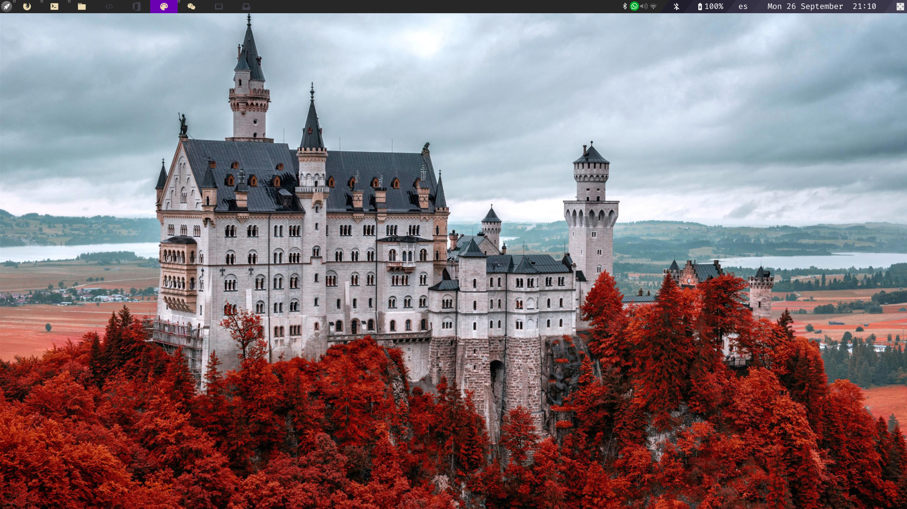

# Configuración personal de AwesomeWM
Esta es la configuración que uso día a día en Linux, con el gestor de ventanas AwesomeWM. Interfaz gráfica y manejo del sistema operativo (principalmente visual) creado completamente desde cero y personalizado.

